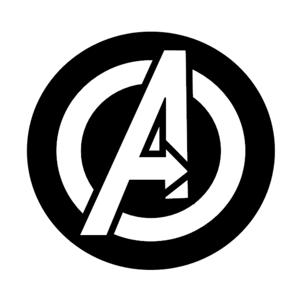
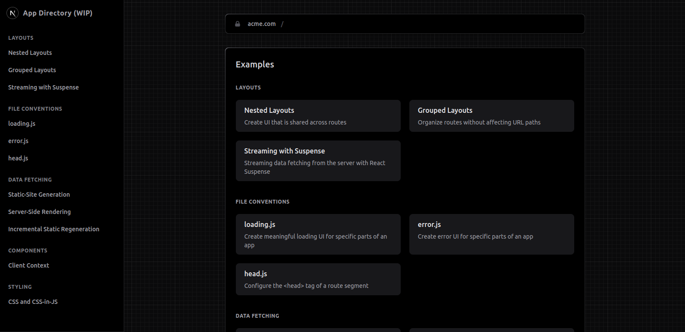

<h1 align="center"> Marvel: Ultimate Guide </h1>

<p align="center">
  Este é um projeto desenvolvido com o framework Next, utilizando CSS Modules e o consumo de APIs para representar em tela os dados que serão resgatados pelas requisições.
</p>

<p align="center">
  <a href="#-tecnologias">Tecnologias</a>&nbsp;&nbsp;&nbsp;|&nbsp;&nbsp;&nbsp;
  <a href="#-projeto">Projeto</a>&nbsp;&nbsp;&nbsp;|&nbsp;&nbsp;&nbsp;
  <a href="#-layout">Layout</a>&nbsp;&nbsp;&nbsp;|&nbsp;&nbsp;&nbsp;
  <a href="#memo-licença">Licença</a>
</p>

<p align="center">
  
</p>

<br>

<p align="center">
  
</p>

## 🚀 Tecnologias

Esse projeto foi desenvolvido com as seguintes tecnologias:

- HTML5, CSS3, JS ES6+
- [Node e Yarn](https://nodejs.org/)
- [Next.JS](https://nextjs.org/)
- [React.JS](https://reactjs.org/)
- [Create next-app](https://nextjs.org/docs/api-reference/create-next-app)
- [Typescript](https://www.typescriptlang.org/)
- [ESLint](https://eslint.org/docs/latest/)
- [Prettier](https://prettier.io/)
- [Husky](https://openbase.com/js/husky/documentation)
- [Lint-staged](https://www.npmjs.com/package/lint-staged/v/8.1.3)

## 💻 Projeto

Este projeto é voltado para a prática e o desenvolvimento das habilidades em Next.JS para criar uma interface responsiva e que represente bem os dados para o usuário usando o consumo de APIs resgatando os dados que serão disponibilizados a quem visitar o site que deverá ser um guia contendo informações sobre personagens de quadrinhos de forma acessível, fácil e completa onde poderão buscar informações complexas e curiosidades para que os fãs aficcionados possam também através deste site desenvolver seus RPGs.

## 🏡 Comandos de execução no projeto

Instalação das dependências do projeto

```sh
yarn
```

Teste da aplicação em ambiente de desenvolvimento

```sh
yarn dev
```

Build da aplicação

```sh
yarn build
```

Teste da aplicação em ambiente de produção

```sh
yarn start
```

Checar a escrita do código com ESLint e Prettier

```sh
yarn check
```

Formatar código

```sh
yarn write
```

## 🔖 Layout

<p align="center">
  
</p>

Para acompanhar o template acesse o site oficial do <a href="https://app-dir.vercel.app/" target="_blank" rel="norefferer">Next.JS</a>.

## 📝 Licença

Esse projeto está sob a licença MIT.

---
